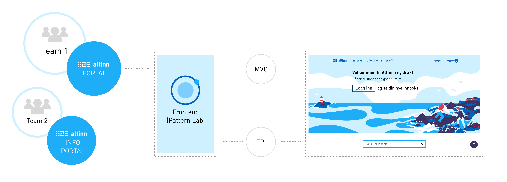

<div id="alert-no-arrow" class="a-message a-message-error a-message--arrow-off a-message--fullwidth mb-2 a-py-minus-1">
  NB: Innholdet og sidene er under utvikling
</div>

<p class="a-leadText a-fontBold">Selv om Altinn er satt sammen av flere ulike bakenforliggende system, sørger vi for en helhetlig og konsistent brukeropplevelse ved hjelp av designsystemet som binder det hele sammen.</p>

Siden vi er flere ulike team som jobber med ulike løsninger (men med samme brukergrensesnitt), trenger vi et felles sted for frontend. Dette er for å sikre at vi kun lager komponentene èn gang og at de fremtrer konsistent i brukergrensesnittet selv om de er implementert i ulike løsninger.



For å komme i gang med utvikling på Altinn og Brønnøysundregistrenes webløsninger, bør du ha kjennskap til hvordan designsystemet er tenkt å fungere som bindeledd mellom de ulike løsningene.

## Pattern Lab

For å bygge designsystemet har vi brukt «Pattern Lab», som er et verktøy for å lage atomiske designsystem. Pattern Lab fungerer som et arbeidsverktøy der frontend-utviklere lager alle UI-komponentene i HTML, CSS og Javasript. Komponentene kan settes sammen til sider, og deretter til en klikkbar prototype som kan brukertestes. Pattern Lab sørger for enkel prototyping og overlevering av CSS, javascript og HTML-kode til backend-utviklere.

<b>Pattern Lab brukes i hovedsak til to formål på Altinn:</b>

- Pattern Lab skal være et hjem for alle UI-komponenter med deres styling og retningslinjer. CSS og javascript for komponentene skal **kun** eksistere og vedlikeholdes her.
- Pattern Lab skal fungere som prototypeverktøy. Alle maler skal i de fleste tilfeller prototypes og brukertestes før implementering.

## Er du backend-utvikler?

Er du backend-utvikler og skal benytte deg av designet fra designsystemet, trenger du ikke å innstallere Pattern Lab som utviklingsmiljø. Du trenger kun å hente ned de distribuerte designfilene (css og javascript) fra [NPM](https://www.npmjs.com/package/altinn-designsystem). I tillegg kan du bruke designsystemet for å finne og kopiere HTML-koden inn i ditt system. (Grunnen til at HTML ikke kan være synkronisert, er at de ulike løsningene er bygget på ulike bakenforliggende system). Designsystemet er versjonsbasert, slik at din løsning kan velge å oppdatere til nyeste versjon av designsystemet når det er ønskelig. NB: jQuery må hentes inn i tillegg.

## Er du frontend-utvikler?

Med definerte UI-komponenter i Patternlab kan man som frontend-utvikler enkelt sy sammen nye maler og prototyper. NB: En designer skal alltid være ivolvert i design av nye brukergrensesnitt.

Skal du jobbe med frontend, må du først klone Git-repositoriet fra Altinns [github](https://github.com/Altinn/DesignSystem) og følge oppskriften der for hvordan du setter opp utviklingsmiljøet.

### Pattern Lab Dokumentasjon
Dokumentasjon for hvordan utvikle atomisk design med Pattern Lab er tilgjengelig på [Pattern Lab](http://patternlab.io/docs/index.html) sine nettsider.

### Rutiner for oppdatering
Når et nytt atom, molekyl eller organisme lages, skal følgene sjekkes:

- Følg retningslinjene for <a href="../guidelines/frontend.html">frontend-kode</a>.
- Dersom du har endret en eksisterende komponent, sjekk at den fortsatt fungerer som den skal på alle steder den er brukt.
- Oppdater komponentens MD-fil med versjon, status, og eventuelle notater relatert til frontend.
- Sjekk at komponenten fungerer i alle skjermstørrelser (responsivt).
- Sjekk at både koden og komponenten er <a href="../guidelines/uu.html">universelt utformet</a> i henhold til kravene.

### Pushe til Github
Vi jobber **ikke** direkte på master-branchen, men en ansvarlig utvikler merger dev-branchen inn i master regelmessig. Du kan velge å jobbe på en egen branch i git, eller pushe direkte til dev-branchen. For å få tilgang til å pushe til Altinns github, snakk med [Eirik Mikkelsen](mailto:eirik.mikkelsen@brreg.no).

### Generere distribuerte js og css-filer
I dist-mappen ligger genererte css og js-filer som benyttes i de implementerte løsningene. For å generere nye filer, kjør ```gulp dist``` i kommandolinjen. Det genereres en fil for hvert prosjekt, slik at en skal slippe å inludere mer css og javascript enn nødvendig.

### Legge ny versjon av designsystemet på NPM
For å få tilgang til å pushe til NPM, snakk med [Eirik Mikkelsen](mailto:eirik.mikkelsen@brreg.no). Når man skal pushe en ny versjon av designsystemet skal package.json oppdateres med nytt versjonsnummer. Skriv hva som er gjort og hvilke komponenter som er påvirket.

### Oppdatere Designsystemets utstillingsvindu
Designsystemet har et eget "utstillingsvindu" (det er her du er akkurat nå). Koden for dette ligger på Git-repositoriet "[designsystem-styleguide](https://github.com/Altinn/designsystem-styleguide)." Dersom du skal oppdatere dette må du først klone Git-repositoriet.

For å importere de siste komponentene fra Pattern Lab inn i utstillingsvinduet, gå tilbake til git-repositoriet "Designsystem" (Pattern Lab), og kjør ```gulp style-guide-export``` i kommandolinjen. Alle patterns vil da havne i "designsystem-styleguide" > "patterns".

For å vise komponentene, må man lage en ny md-fil under ønsket kategori i "components"-mappen. F.eks under "skjemakomponenter". Deretter må md-filen oppdateres med info og referere til korrekt pattern.

### Github gh-pages
Vi har en egen branch som heter "gh-pages". Filene som ligger i denne branchen vises som en demo på [altinn.github.io/DesignSystem/](altinn.github.io/DesignSystem/) .

Her ligger følgende:
- Alle filer som ligger under "designsystem-styleguide" > "_site". (Index-filen vil da sørge for at designsystemets utstillingsvindu er tilgjengelig på demoen over.)
- Innholdet fra PatternLabs "public"-mappe, slik at frontendmiljøet kan være synlig fra [altinn.github.io/DesignSystem/PatternLab](altinn.github.io/DesignSystem/PatternLab)
- Et par andre mapper som er relevant for tidligere versjoner av prototypen

For å oppdatere [altinn.github.io/DesignSystem/](altinn.github.io/DesignSystem/), kopier de nyeste filene fra "designsystem-styleguide" > "_site" og innholdet fra PatternLabs "public"-mappe. Kjør ```git checkout gh-pages``` i "Designsystem"-repositoriet, og lim inn de nye filene.

```
git add -A
git commit -m "latest from dev"
git pull origin gh-pages
git push origin gh-pages
git checkout dev
```
