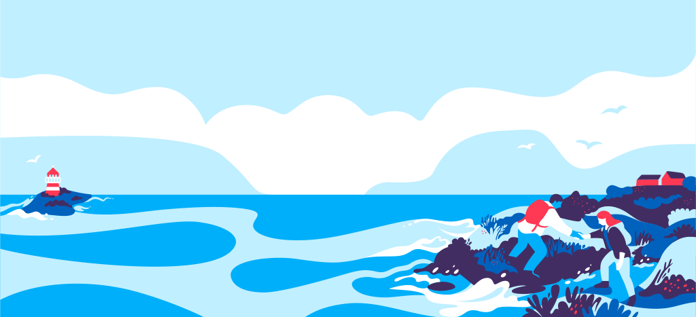
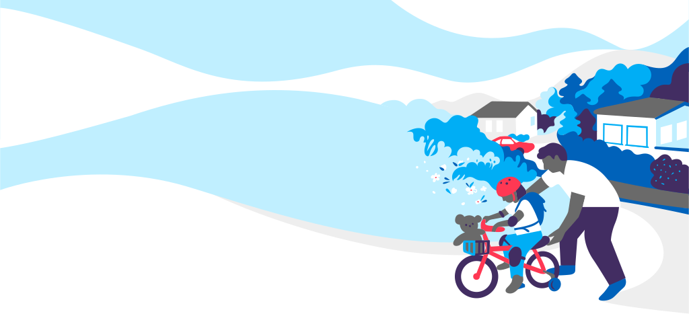

  NB: Innholdet og sidene er under utvikling

Illustrasjonene brukt på altinn er spesialtegnet for å forsterke det visuelle uttrykket og myke opp budskapet.

## Målet med illustrasjonene
Illustrasjonene skal:
- Heve brukeropplevelsen og styrke Altinns posisjon hos nye brukergrupper
- Ha en gjennomgående egenart og gjenkjennelighet
- Fange blikket, differensiere sidene, myke opp budskapet og heve helhetsinntrykket
- Ha et naturlig visuelt slektskap til resten av det visuelle uttrykket
- Baseres på fargepaletten og formspråket i designet som ligger til grunn

## Bruk av illustrasjoner
Illustrasjoner på Altinn skal brukes enten som [bakgrunnsillustrasjon](../komponenter/bilder-og-media/bakgrunnsillustrasjon.html), eller som illustrasjoner ved siden av tekst (de skal da være innrammet i en sirkel). F.eks:

  

  

    <h2>Eksempel på illustrasjon</h2>
    
Lorem ipsum dolor sit amet, consectetur adipisicing elit, sed do eiusmod tempor incididunt ut labore et dolore magna aliqua. Ut enim ad minim veniam quis nostrud. 

  

## Alle illustrasjoner
Det jobbes for tiden med å lage flere illustrasjoner. Foreløpig har vi følgende tilgjengelig:

### Forside / Logg inn

### Hjelpesenter

### Starte og drive

### Arbeidsforhold

### Regnskap og revisjon

### Skatt og avgift

