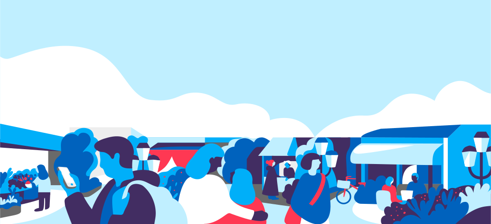

Illustrasjonene er tegnet av illustratør Sandra Blikås. De er spesialtilpasset grid, layout og fargepalett. Motivene viser hverdagssituasjoner som er tolkninger av sentrale tema i Altinns innhold.

## Retningslinjer for illustrasjonsbruk:
- Illustrasjonene på Altinn er en vesentlig del av altinns visuelle identitet på nett.
- Illustrasjonene skal brukes sparsomt og kun der de gir verdi.
- Det skal **ikke** brukes andre «redaksjonelle» illustrasjoner enn disse på altinn.no.
- Der det gir vesentlig verdi kan det utvikles mer funksjonelle illustrasjoner som infografikk el. Slik illustrasjoner skal bygge på vår visuelle identitet og utviklingen bør skje i samråd med UX-ansvarlig.
- De store illustrasjonene brukes på forsider og fremhevede artikler. Mindre illustrasjoner brukes primært på navigasjonssider og informasjonssider for å myke opp innholdet.
- All endring av eksisterende illustrasjoner, bruksendring eller utvikling av nye illustrasjoner skal skje gjennom UX-ansvarlig i Altinn.

## Eksempel på bruk
Illustrasjoner på Altinn skal brukes enten som [bakgrunnsillustrasjon](../komponenter/bilder-og-media/bakgrunnsillustrasjon.html), eller som illustrasjoner [ved siden av tekst](../komponenter/bilder-og-media/bildeblokk.html) (de skal da være innrammet i en sirkel). F.eks:

  

  

    <h2>Mindre illustrasjon</h2>
    
Mindre illustrasjon som står ved siden av tekst for å myke opp innholdet. Lorem ipsum dolor sit amet, consectetur adipisicing elit, sed do eiusmod tempor incididunt ut labore et dolore magna aliqua. 

  

## Tilgjengelige illustrasjoner
Foreløpig har vi følgende illustrasjoner tilgjengelig:

### Forside / Logg inn

### Hjelpesenter

### Starte og drive

### Arbeidsforhold

### Regnskap og revisjon

### Skatt og avgift

